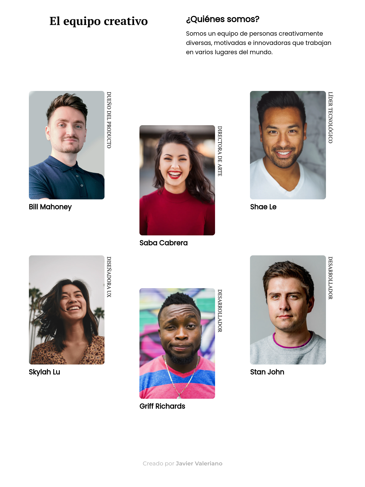

<!-- Please update value in the {}  -->

<h1 align="center">My team page | Mi página de equipo</h1>

   Solution for a challenge from  <a href="http://devchallenges.io" target="_blank">Devchallenges.io</a>. | Solución para un desafío de <a href="http://devchallenges.io" target="_blank">Devchallenges.io</a>.

  <h3>
    <a href="https://javiervaleriano.github.io/devchallenge-teampage/">
      Demo
    </a>
     | 
    <a href="https://devchallenges.io/solutions/VSJLesV9fTgIz5ut4kMs">
      Solution / Solución
    </a>
     | 
    <a href="https://devchallenges.io/challenges/hhmesazsqgKXrTkYkt0U">
      Challenge / Desafío
    </a>
  </h3>

<!-- TABLE OF CONTENTS -->

## Table of Contents | Tabla de contenido

- [Overview | Visión general](#overview--visi%C3%B3n-general)
  - [Built With | Construido con](#built-with--construido-con)
- [Features | Características](#features--caracter%C3%ADsticas)
- [Acknowledgements | Agradecimientos](#acknowledgements--agradecimientos)
- [Contact | Contacto](#contact--contacto)

<!-- OVERVIEW -->

## Overview | Visión general

### Desktop | Escritorio

### Mobile | Móvil

Hello everyone, I hope you are well. This is my [solution](https://devchallenges.io/solutions/VSJLesV9fTgIz5ut4kMs) to [challenge](https://devchallenges.io/challenges/hhmesazsqgKXrTkYkt0U) from Devchallenges.io. |
Hola a todos, espero que estén bien. Esta es mi [solución](https://devchallenges.io/solutions/VSJLesV9fTgIz5ut4kMs) al [desafío](https://devchallenges.io/challenges/hhmesazsqgKXrTkYkt0U) de Devchallenges.io

Here you can see my [demo](https://javiervaleriano.github.io/devchallenge-teampage/). | Aquí pueden ver mi [demo](https://javiervaleriano.github.io/devchallenge-teampage/).

This time I take advantage of the use of JavaScript to make CSS animations according to the width of the screen, something that had not occurred to me to do before. I also give a random link to the footer link. |
En esta ocasión aprovecho el uso de JavaScript para realizar animaciones con CSS según el ancho de la pantalla, algo que no se me había ocurrido hacer antes. También otorgo un enlace aleatorio al link del footer.

### Built With | Construido con

<!-- This section should list any major frameworks that you built your project using. Here are a few examples.-->

- [HTML](https://developer.mozilla.org/es/docs/Learn/HTML/Introduction_to_HTML)
- [CSS](https://developer.mozilla.org/es/docs/Learn/CSS)
- [JavaScript](https://developer.mozilla.org/es/docs/Web/JavaScript)

## Features | Características

<!-- List the features of your application or follow the template. Don't share the figma file here :) -->

This application/site was created as a submission to a [DevChallenges](https://devchallenges.io/challenges) challenge. The [challenge](https://devchallenges.io/challenges/hhmesazsqgKXrTkYkt0U) was to build an application to complete the given user stories | Esta aplicación/sitio se creó como una entrega a un desafío de [Devchallenges](https://devchallenges.io/challenges). El [desafío](https://devchallenges.io/challenges/hhmesazsqgKXrTkYkt0U) fue crear una aplicación para completar las historias de usuario dadas:

- User story: I can see a page following the given design. | Historia de usuario: Puedo ver una página siguiendo el diseño dado.

## Acknowledgements | Agradecimientos

<!-- This section should list any articles or add-ons/plugins that helps you to complete the project. This is optional but it will help you in the future. For exmpale -->

- [:nth-child](https://developer.mozilla.org/es/docs/Web/CSS/:nth-child); For specific selection of sibling elements with CSS | Para la selección específica de elementos hermanos con CSS.

## Contact | Contacto

- [Devchallenges profile | Perfil de Devchallenges](https://devchallenges.io/portfolio/javiervaleriano)
- Codepen: [@javiervaleriano](https://codepen.io/javiervaleriano)
- GitHub: [@javiervaleriano](https://github.com/javiervaleriano)
- Instagram: [@javiervalerianoz](https://www.instagram.com/javiervalerianoz/)
- Twitter: [@javaleriano2](https://twitter.com/javaleriano2)
